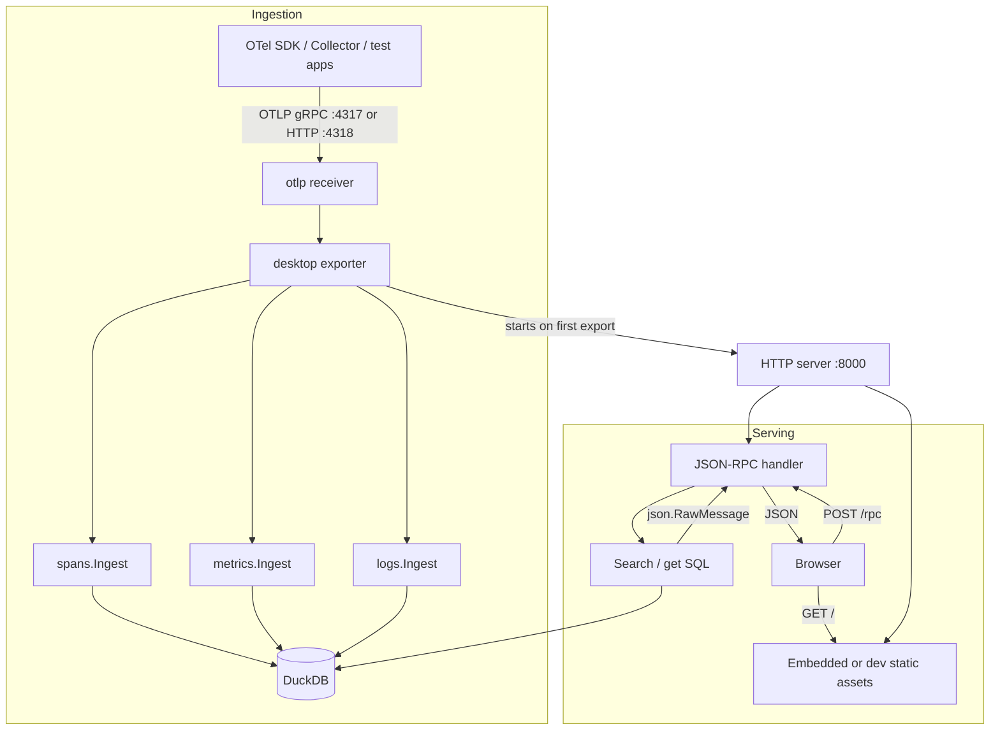

# otel-desktop-viewer Architecture

otel-desktop-viewer is a custom [OpenTelemetry Collector](https://github.com/open-telemetry/opentelemetry-collector) distribution with a single custom **`desktop` exporter**. The exporter receives OTLP traces, metrics, and logs, stores them in **DuckDB**, and serves a **Svelte 5** web UI over **HTTP + JSON-RPC**.

The design optimizes for local development: easy install, minimal moving parts, fast analytical queries over telemetry, and a UI for exploring all three signals.

## System overview



**Default ports**

| Port | Purpose |
|------|---------|
| 4317 | OTLP gRPC |
| 4318 | OTLP HTTP |
| 8000 | Web UI + JSON-RPC (`POST /rpc`) |
| 3001 | Vite dev server (frontend only; proxies `/rpc` → 8000) |

## Repository layout

```
otel-desktop-viewer/
├── main.go                    # CLI entry; builds inline collector config from flags
├── main_others.go / main_windows.go
├── components.go              # OCB-generated component registry
├── desktopexporter/           # Custom exporter Go module
│   ├── factory.go             # Exporter factory + shared-component wiring
│   ├── exporter.go            # pushTraces / pushMetrics / pushLogs
│   └── internal/
│       ├── server/            # HTTP server, JSON-RPC, embedded static assets
│       ├── store/             # DuckDB store, schema, ingest, search, query
│       └── frontend/          # Svelte 5 + Vite UI
├── scripts/                   # OTLP seed scripts for local dev
├── Makefile                   # Build, run, dev, test targets
└── ARCHITECTURE.md
```

The root module builds the collector binary. `desktopexporter/` is a nested Go module (see `go.work`). The frontend builds into `desktopexporter/internal/server/static/` for production embed.

## Collector binary

Built with the [OpenTelemetry Collector Builder (OCB)](https://github.com/open-telemetry/opentelemetry-collector/tree/main/cmd/builder). Generated files (`main.go`, `components.go`) should not be edited by hand except where already customized.

**Registered components** (`components.go`):

| Kind | Component | Used in default config? |
|------|-----------|---------------------------|
| Receiver | `otlp` (HTTP + gRPC) | Yes |
| Exporter | `desktop` | Yes |
| Processor | `batch` | Registered, **not wired** into default pipelines |

**Default pipelines** (built from CLI flags in `main.go`):

```
traces:  otlp → desktop
metrics: otlp → desktop
logs:    otlp → desktop
```

**CLI flags**

| Flag | Default | Purpose |
|------|---------|---------|
| `--http` | 4318 | OTLP HTTP listen port |
| `--grpc` | 4317 | OTLP gRPC listen port |
| `--browser-port` | 8000 | UI + JSON-RPC port |
| `--host` | localhost | Bind address for all endpoints |
| `--db` | *(empty)* | DuckDB file path; empty = in-memory |
| `--open-browser` | true | Open UI on startup |

Configuration is injected as inline YAML resolver URIs at startup. There is no `--config` file path exposed by the CLI today, though the underlying collector supports YAML providers.

## Desktop exporter

The `desktop` exporter is the heart of the application. For a given config it owns:

1. A **DuckDB store** (`internal/store`)
2. An **HTTP server** (`internal/server`) that serves the UI and JSON-RPC

Trace, metrics, and logs exporters are created separately by the collector factory, but they **share one `desktopExporter` instance** per config via `sharedcomponent` (`factory.go`). This ensures a single database and a single HTTP listener.

**Ingest path** (`exporter.go`):

```
OTLP pdata → exporterhelper → pushTraces|pushMetrics|pushLogs → store.WithConn → spans|metrics|logs.Ingest
```

Ingest writes directly from OpenTelemetry pdata into DuckDB appenders. There are no intermediate Go domain structs between OTLP and storage.

**Lifecycle**: The HTTP server starts in `Start()` on a goroutine. Shutdown closes the server, then the store.

## Storage (DuckDB)

**Engine**: DuckDB via `github.com/duckdb/duckdb-go/v2` (CGO required).

**Connection model**: `store.Store` wraps a mutex-protected `driver.Conn`. All reads and writes go through `WithConn` to serialize access.

### Schema

Schema is defined in `desktopexporter/internal/store/schema/schema.go` and applied on store creation.

**Core tables**

| Table | Role |
|-------|------|
| `spans` | Span records; `service_name` denormalized from `service.name` |
| `events` | Span events (normalized) |
| `links` | Span links (normalized) |
| `logs` | Log records; `service_name` denormalized |
| `metric_streams` | Canonical identity for a logical metric (name, unit, type, scope, service, …) |
| `metric_ingests` | One row per OTLP batch arrival for a stream (description, dropped counts) |
| `datapoints` | All metric data points in one table; `metric_type` discriminates gauge/sum/histogram/exponential histogram |
| `exemplars` | Metric exemplars (normalized) |
| `attributes` | Normalized key/value attributes for all entity types |

**Design themes**

- **All IDs are UUIDs.** OpenTelemetry 8-byte span IDs are zero-padded to 16 bytes on ingest.
- **Normalized nested data.** Events, links, exemplars, and attributes live in separate tables—not nested arrays or DuckDB UNION types.
- **Single `datapoints` table.** Type-specific columns use NULLs for irrelevant fields; `metric_type` + CHECK constraints enforce the discriminated union. Columnar compression makes sparse rows cheap.
- **`metric_streams` + `metric_ingests`.** Stream identity is deduplicated across batches; per-batch metadata varies without splitting logical metrics.
- **`attributes` table.** Multiple nullable owner ID columns (`span_id`, `event_id`, `link_id`, `log_id`, `metric_ingest_id`, `datapoint_id`, `exemplar_id`) plus a `scope` column (`resource`, `scope`, `span`, etc.). CHECK constraints enforce exactly one owner pattern per row.
- **Depth is computed at query time** via recursive CTEs when building trace waterfalls—not stored on ingest.

### Ingest

| Signal | Package | Notes |
|--------|---------|-------|
| Traces | `store/spans` | Flushes appenders every 50 rows |
| Metrics | `store/metrics` | Stream find-or-insert, then datapoints/exemplars/attributes |
| Logs | `store/logs` | Flushes appenders every 100 rows |

Shared helpers in `store/ingest/` manage DuckDB appenders and attribute rows.

## Query layer and API

### JSON rows from DuckDB

Query functions build JSON in SQL using `json_object`, `json_arrayagg`, `to_json`, etc., and scan each result row into `json.RawMessage`. The JSON-RPC layer forwards these bytes without Go response structs.

**Why**: Response shape is defined once in SQL. No duplicate struct tags, no scan-then-marshal step. The frontend is the primary consumer.

**Trade-off**: Response structure is not statically typed in Go; it lives in SQL strings.

### Search

The frontend builds a **query tree** (`components/shared/Search/queryTree`). `store/search/search_tree.go` walks the tree and generates SQL with:

- Positional parameter binding (ordered param list)
- `{COND}` placeholders for composable WHERE fragments
- `{RAW}` for array containment checks
- Signal-specific field mappers in `spans`, `logs`, and `metrics` packages

Global search casts scalar fields to strings and searches attribute key/value pairs via the normalized `attributes` table.

### HTTP server

`internal/server/server.go`:

| Route | Handler |
|-------|---------|
| `POST /rpc` | JSON-RPC 2.0 (`golang.org/x/exp/jsonrpc2`) |
| `GET /traces/{id}` | Serves `index.html` (SPA fallback for client-side routing) |
| `GET /*` | Static files (embedded `static/` or `STATIC_ASSETS_DIR`) |

CORS is enabled for local dev (Vite on port 3001).

**Static assets**

- **Production**: embedded via `//go:embed static` after `make build-ts`
- **Development**: set `STATIC_ASSETS_DIR` to `frontend/dist` (Makefile `run-go` / `dev-go` do this)

### JSON-RPC methods

| Method | Purpose |
|--------|---------|
| `searchTraces` | Trace summaries for list view |
| `searchSpans` | Full trace with spans, events, links, attributes |
| `getTraceSpanCount` | Span count for a trace |
| `getTraceAttributes` / `getAttributesByTraceID` | Attribute discovery for traces |
| `searchLogs` / `getLog` | Log list and detail |
| `getLogAttributes` | Attribute discovery for logs |
| `searchMetricSummaries` | Metric stream list |
| `getMetric` / `searchMetrics` / `getMetrics` | Metric detail and time series |
| `getMetricAttributes` | Attribute discovery for metrics |
| `getStats` | Counts of traces, logs, metrics (used for polling) |
| `clearTraces` / `clearLogs` / `clearMetrics` | Delete all data for a signal |
| `deleteSpansByTraceID` / `deleteSpanByID` / `deleteLogByID` | Targeted deletes |

Domain errors map to JSON-RPC error codes in `internal/server/errors.go` (e.g. `-32013` for unspecified metric temporality).

## Frontend

**Location**: `desktopexporter/internal/frontend/`

### Stack

| Layer | Choice |
|-------|--------|
| Framework | Svelte 5 (runes: `$state`, `$derived`, `$effect`) |
| Build | Vite 7 |
| Routing | tinro5 (history mode) |
| Styling | Tailwind CSS 4 + DaisyUI 5 |
| Components | bits-ui |
| Search UI | CodeMirror 6 + Lezer grammar (`SignalToolbar/search/lang/`) |
| Charts | layerchart |
| Tests | Vitest + svelte-check |

### Routing

`App.svelte`:

| Route | Page |
|-------|------|
| `/` | Home — onboarding, OTLP setup snippets, stats |
| `/traces` | Trace list, waterfall, span detail |
| `/logs` | Log list and detail |
| `/metrics` | Metric summaries, charts, detail panels |

The server exposes `GET /traces/{id}` as an SPA fallback, but the frontend does not register a matching tinro route today—deep links to individual traces rely on in-app navigation.

### State management

No global store library. State uses Svelte **context modules** (`.svelte.ts`) and page-local `$state`:

| Context | Scope |
|---------|-------|
| `time-context.svelte.ts` | App-wide time range and timezone |
| `metric-view-context.svelte.ts` | Per-metrics-page chart aggregation, heatmaps, legend |
| `panel-split-resize-context.svelte.ts` | Resizable panel preferences |
| `theme.svelte.ts` | DaisyUI theme via `data-theme` |

Each signal page owns list/selection state locally.

### UI layout pattern

Three-pane model via `PageLayout.svelte` and `SignalListDrawer.svelte`:

1. **Drawer** — navigation, search toolbar, virtualized list
2. **Main** — waterfall (traces), chart/table (metrics), or log stream
3. **Detail** — span/log/metric inspector (optional resizable split)

### API client

`services/telemetry-service.ts` posts JSON-RPC requests to `/rpc`. It revives bigint timestamps and typed fields on the client. Search queries are sent as query trees; time ranges are converted to nanosecond strings for the backend.

**Metrics**: The backend returns raw datapoints; histogram quantiles, rates, heatmaps, and legend state are computed client-side in `metric-view-context.svelte.ts`.

### Real-time updates

The UI **polls** `getStats` on an interval to detect new data and show refresh affordances. There is no WebSocket push channel.

## Data flows

### Write path (ingest)

```
App / SDK
  → OTLP (gRPC or HTTP)
  → otlp receiver
  → desktop exporter (exporterhelper)
  → spans|metrics|logs.Ingest
  → DuckDB appenders (entities + attributes in FK order)
```

### Read path (traces example)

```
TracesPage
  → telemetryAPI.searchTraces(startNs, endNs, queryTree)
  → POST /rpc searchTraces
  → spans.SearchTraces (SQL + search tree → []json.RawMessage)
  → Trace list rendered

User selects trace
  → searchSpans(traceID)
  → Full trace JSON with depth CTE, events, links, attributes
  → Waterfall + detail panels
```

### Dev workflow

```
Terminal 1: make dev-go     # Go server on :8000, seeds sample data
Terminal 2: make dev-ts     # Vite on :3001, proxies /rpc → :8000
Browser:    http://localhost:3001
```

Or run production-like: `make build && ./otel-desktop-viewer` (embedded assets, opens browser on :8000).

## Key design decisions

| Decision | Choice | Rationale |
|----------|--------|-----------|
| Storage | DuckDB | Columnar OLAP; fast filters and aggregations on local telemetry |
| Schema | Normalized tables | Query events, links, attributes, datapoints independently; avoid UNION/MAP pain |
| Metric identity | `metric_streams` + `metric_ingests` | Dedupe logical streams; preserve per-batch metadata |
| Datapoints | Single table with NULLs | Simpler than per-type tables; columnar NULL compression |
| Attributes | Shared table + owner ID columns | FK integrity, indexed search, attribute discovery |
| Ingest | pdata → DuckDB appenders | No intermediate Go structs |
| API responses | JSON rows from SQL | SQL is the single source of truth for response shape |
| Transport | JSON-RPC over HTTP | One endpoint; typed methods; no REST surface |
| Frontend updates | Polling `getStats` | Simple; sufficient for local dev viewer |
| Span depth | Query-time recursive CTE | Handles orphan spans finding parents in later batches |

## Not implemented (yet)

These appear in older notes or collector capabilities but are **not** part of the current architecture:

- WebSocket push / live tail
- `--config` YAML file exposed on the CLI (inline flag-built config only)
- `batch` processor in default pipelines
- `exporterhelper.WithRetry()` on the desktop exporter
- Frontend route for `/traces/:id` deep linking

## Related files

**Backend entry and wiring**: `main.go`, `components.go`, `desktopexporter/factory.go`, `desktopexporter/exporter.go`

**Server and API**: `desktopexporter/internal/server/server.go`, `jsonrpc_handler.go`, `errors.go`

**Storage**: `desktopexporter/internal/store/store.go`, `schema/schema.go`, `spans/`, `metrics/`, `logs/`, `search/search_tree.go`

**Frontend**: `desktopexporter/internal/frontend/src/App.svelte`, `pages/`, `services/telemetry-service.ts`, `contexts/`

**Tooling**: `Makefile`, `Dockerfile`, `.goreleaser.yaml`
