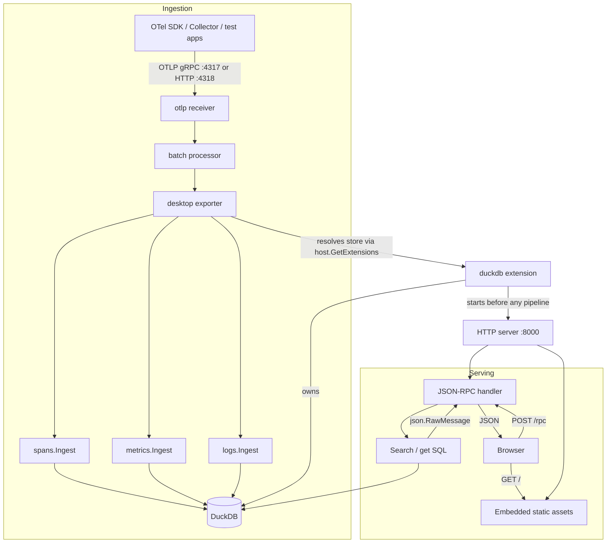

# otel-desktop-viewer Architecture

otel-desktop-viewer is a custom [OpenTelemetry Collector](https://github.com/open-telemetry/opentelemetry-collector) distribution built from two custom components: a **`desktop` exporter** that writes OTLP traces, metrics, and logs into storage, and a **`duckdb` extension** that owns the **DuckDB** store and serves a **Svelte 5** web UI over **HTTP + JSON-RPC**.

The design optimizes for local development: easy install, minimal moving parts, fast analytical queries over telemetry, and a UI for exploring all three signals.

## System overview


```mermaid
flowchart TB
  subgraph ingest [Ingestion]
    SDK[OTel SDK / Collector / test apps] -->|OTLP gRPC :4317 or HTTP :4318| OTLP[otlp receiver]
    OTLP --> Batch[batch processor]
    Batch --> Desktop[desktop exporter]
    Desktop --> Spans[spans.Ingest]
    Desktop --> Metrics[metrics.Ingest]
    Desktop --> Logs[logs.Ingest]
    Spans --> DuckDB[(DuckDB)]
    Metrics --> DuckDB
    Logs --> DuckDB
  end

  subgraph serve [Serving]
    Browser[Browser] -->|GET /| Static[Embedded static assets]
    Browser -->|POST /rpc| RPC[JSON-RPC handler]
    RPC --> Query[Search / get SQL]
    Query --> DuckDB
    Query -->|json.RawMessage| RPC
    RPC -->|JSON| Browser
  end

  DuckDBExt[duckdb extension] -->|starts before any pipeline| HTTP[HTTP server :8000]
  DuckDBExt -->|owns| DuckDB
  Desktop -->|resolves store via host.GetExtensions| DuckDBExt
  HTTP --> Static
  HTTP --> RPC
```

The `desktop` exporter writes; it does not own the store. Ownership of the DuckDB database, the HTTP server, and the retention loop lives in a separate `duckdb` extension, which the collector starts before any pipeline component and stops after — exactly the lifetime the store needs. Each signal's exporter instance finds the shared store by looking it up in the collector's extensions map at `Start`.

**Default ports**

| Port | Purpose |
|------|---------|
| 4317 | OTLP gRPC |
| 4318 | OTLP HTTP |
| 8000 | Web UI + JSON-RPC (`POST /rpc`) |
| 3001 | Vite dev server (frontend only; proxies `/rpc` → 8000) |

## Repository layout

```
otel-desktop-viewer/
├── main.go                    # CLI entry; builds inline collector config from flags
├── main_others.go / main_windows.go
├── components.go              # OCB-generated component registry
├── desktopexporter/           # Custom exporter package (write-only)
│   ├── factory.go             # Exporter factory
│   ├── exporter.go            # pushTraces / pushMetrics / pushLogs; resolves the store from the duckdb extension
│   ├── duckdbextension/       # Owns the store, HTTP server, and retention loop
│   └── internal/
│       ├── server/            # HTTP server, JSON-RPC, embedded static assets
│       ├── store/             # DuckDB store, schema, ingest, search, query
│       └── frontend/          # Svelte 5 + Vite UI
├── scripts/                   # OTLP seed scripts for local dev
├── Makefile                   # Build, run, dev, test targets
└── ARCHITECTURE.md
```

The root module builds the collector binary. The frontend builds into `desktopexporter/internal/server/static/` for production embed.

## Collector binary

Built with the [OpenTelemetry Collector Builder (OCB)](https://github.com/open-telemetry/opentelemetry-collector/tree/main/cmd/builder). Generated files (`main.go`, `components.go`) should not be edited by hand except where already customized. The distribution currently builds against **collector v0.158.0 / v1.64.0** (`go.mod`); `components.go` also records module versions in `ReceiverModules` / `ProcessorModules` / `ExtensionModules` metadata strings (keep these in sync when bumping). Requires **Go 1.26**.

**Registered components** (`components.go`):

| Kind | Component | Used in default config? |
|------|-----------|---------------------------|
| Receiver | `otlp` (HTTP + gRPC) | Yes |
| Exporter | `desktop` | Yes |
| Processor | `batch` | Yes, wired into all three default pipelines |
| Extension | `duckdb` (`desktopexporter/duckdbextension`) | Yes; owns the store, the HTTP server, and retention |

**Default pipelines** (built from CLI flags in `main.go`):

```
traces:  otlp → batch → desktop
metrics: otlp → batch → desktop
logs:    otlp → batch → desktop
```

`batch` merges on `send_batch_size: 8192` or a `1s` timeout, whichever comes first — sized so the exporter's own ingest deadline stays meaningful (see Lifecycle, below) and so light, interactive traffic still lands within a second rather than waiting for a merge threshold it will never reach.

**CLI flags**

| Flag | Default | Purpose |
|------|---------|---------|
| `--http` | 4318 | OTLP HTTP listen port |
| `--grpc` | 4317 | OTLP gRPC listen port |
| `--browser-port` | 8000 | UI + JSON-RPC port (`duckdb` extension's `endpoint`) |
| `--host` | localhost | Bind address for all endpoints |
| `--db` | *(empty)* | DuckDB file path; empty = in-memory |
| `--db-max-size` | *(empty)* | Store size cap (e.g. `512MB`, `2GB`); oldest telemetry pruned when exceeded. `0` disables pruning. Defaults to 512 MB in-memory, 2 GB on disk. |
| `--open-browser` | true | Open UI on startup |
| `--telemetry` | false | Emit the viewer's own traces and metrics back to its own OTLP receiver, so the collector's operation is visible in its own UI. Sets both the `desktop` exporter's and the `duckdb` extension's telemetry mode to `self`; ingest spans are suppressed in that mode so instrumenting the write does not itself generate more writes to measure. |

Configuration is injected as inline YAML resolver URIs at startup. There is no `--config` file path exposed by the CLI today, though the underlying collector supports YAML providers.

## Desktop exporter and DuckDB extension

Ownership of the store split from the exporter into a separate collector **extension**. The `desktop` exporter is now write-only: it has no state of its own beyond a store reference, resolved at startup. The `duckdb` extension (`desktopexporter/duckdbextension/`) owns:

1. A **DuckDB store** (`internal/store`)
2. An **HTTP server** (`internal/server`) that serves the UI and JSON-RPC
3. The **retention loop**

This split exists because the collector starts extensions before any pipeline component and shuts them down after (documented ordering of `service.Start` / `service.Shutdown`), which is exactly the lifetime the store needs: up before the first ingest, alive until the last queued write has drained. It also replaces a hand-rolled `sharedcomponent` package that used to give the three signal exporters one instance to share per config — that package is gone; sharing now happens through the extensions map instead of through shared construction.

Trace, metrics, and logs exporters are still created separately by the collector factory, and each is an **independent `desktopExporter` instance** with no state shared between them at construction time. What they share is the extension: at `Start`, each walks `host.GetExtensions()` for anything satisfying a small `storeHost` interface (`Store() *store.Store`) and keeps that pointer. Exactly one store-owning extension must be configured — none is a startup error telling the operator to add `duckdb` under `extensions`, and more than one is also rejected rather than picking a target by map iteration order.

**Ingest path** (`exporter.go`):

```
OTLP pdata → batch processor → exporterhelper sending queue → pushTraces|pushMetrics|pushLogs → store.WithConn → spans|metrics|logs.Ingest
```

Ingest writes directly from OpenTelemetry pdata into DuckDB appenders. There are no intermediate Go domain structs between OTLP and storage. The exporter's own `sending_queue` is enabled by default (one consumer, `BlockOnOverflow`, no batching of its own — batching is the `batch` processor's job) so OTLP receipt is decoupled from the DuckDB write; disabling it restores a synchronous path where the client blocks on, and sees the error from, the store write. Each push imposes an `IngestTimeout` of 30s as a backstop against a hung write holding the store's write lock indefinitely, not as a latency control — deliberately far above the working range, because tripping it means a batch is cut short mid-flush.

**Lifecycle**: the `duckdb` extension's `Start` opens the store, builds the HTTP server, and — if a retention cap applies — starts the retention loop; `Shutdown` reverses that order: cancel the retention loop and wait for it, shut down the HTTP server and wait for its serve goroutine, then close the store. Closing the store takes its write lock, which would otherwise wait on any in-flight reader past the collector's shutdown deadline; the extension bounds that close by `ctx` and logs a warning rather than hang; an unclosed store loses at most its WAL, which DuckDB replays on next open. The exporter's own `Start` is comparatively trivial: it just resolves the shared store from the extensions map. Ingest paths check `ctx.Err()` before work and on every record (metrics pass 1 included); `CloseAppenders` on exit flushes buffered rows.

**Retention**: `--db-max-size` sets a byte cap on stored telemetry, applied to the `duckdb` extension's config. When usage exceeds the cap, the oldest traces, logs, and metrics are pruned by a loop that runs every 30 seconds. `getStats` reports current usage and the configured cap alongside signal counts.

## Storage (DuckDB)

**Engine**: DuckDB via `github.com/duckdb/duckdb-go/v2` (CGO required).

**Connection model**: `store.Store` holds two handles to one DuckDB database, ordered by a `sync.RWMutex` plus a second mutex that serializes ingest against itself.

- `conn` — a dedicated `driver.Conn` from `connector.Connect`, used only by ingest. DuckDB appenders are bound to the connection that created them, so ingest cannot run on the pool.
- `db` — a `*sql.DB` pool from `sql.OpenDB`, used by every query and by the delete/checkpoint paths. The pool is capped via `SetMaxOpenConns`, because each pooled connection is a real DuckDB connection with real memory cost.

Access is chosen by intent, not by handle:

| Method | Lock | Handle | Used by |
|--------|------|--------|---------|
| `WithConn` | `ingestMu`, then read | `conn` | ingest (appenders) |
| `WithDBWrite` | write | `db` | clear, delete, retention prune + checkpoint |
| `WithDBRead` | read | `db` | all queries |

The write lock means "no ingest and no queries", and belongs to pool mutations alone. Ingest takes the *read* lock, so queries run alongside a batch being appended; `ingestMu` is what keeps two ingest calls off one appender connection, which the read lock cannot do.

Ingest reading rather than writing is deliberate. Appending on `conn` and querying on `db` are two DuckDB connections to one database, and DuckDB's MVCC serves a reader alongside a writer unaided — verified by running pooled `SELECT`s against a continuous 20,000-span appender ingest with no lock at all: 1,225 reads, no failures, no races. Excluding readers for a batch's duration bought nothing and cost latency in proportion to batch size; a reader waited 159ms behind a 50,000-span batch to perform 0.2ms of work.

Pool mutations must still exclude ingest, and the sharpest reason is the orphan sweep: ingest inserts dictionary rows before flushing the owner rows that reference them, so a sweep landing in that window would delete rows the in-flight batch is about to point at. No error and no failed constraint, since no foreign key reaches into a `uuid[]` — the attributes would simply stop appearing.

What this does **not** guarantee: a query does not see rows that an in-flight ingest has appended but not yet flushed. DuckDB appenders buffer client-side and become visible on flush — automatically at the chunk threshold, or on `Flush`/`Close` at the end of each ingest call. Under load the UI can lag ingest by up to one batch. That is a visibility window, not a lost write. Queries running alongside ingest widens that window rather than changing its nature: a read can now land mid-batch, and can see dictionary rows whose owners have not flushed. Benign for queries, which join owner→attributes; the one visible effect is that the attribute-key dropdown may list a key a moment before its spans appear.

`EnforceRetention` takes the write lock once per prune round rather than across a whole pass, so queries interleave between rounds instead of blocking for up to three checkpoints.

`Store` exposes no accessor for its `*sql.DB`. Handing out the pool would let a caller query after the lock released, which is the ordering these methods exist to enforce, so every caller — production and test alike — passes a closure to `WithDBRead` or `WithDBWrite`. CI enforces this: a `.DB()` call outside `_test.go` files fails the `go-checks` job.

### Schema

Schema lives in `desktopexporter/internal/store/queries/ddl/` as one `.sql` file per object — `types/`, `tables/`, `indexes/`, `macros/` — applied in order on store creation. The order is read at init from an `_order` manifest file in each directory (`queries/ddl_order.go`), one filename per line, rather than a directory walk: creation order is load-bearing (a table must follow the tables it references; a macro must follow the macros it calls), so it has to be written down somewhere a directory listing can't silently reshuffle, and a file nobody sequenced fails loudly at startup instead of sorting itself into the middle of the schema. `store/schema` retains only `version.go`, whose queries run *before* this DDL to decide whether running it is safe at all.

**Core tables**

| Table | Role |
|-------|------|
| `attributes` | Dictionary of distinct `(key, value, type, scope)` rows, keyed by a content hash |
| `resources` | Deduped resources, shared across all three signals; `seq` is the wire key |
| `scopes` | Deduped instrumentation scopes; `seq` is the wire key |
| `spans` | Span records; `resource_id`, `scope_id`, `attribute_ids`, plus `service_name` denormalized from `service.name` |
| `events` | Span events (normalized) |
| `links` | Span links (normalized) |
| `logs` | Log records; same reference columns as `spans` |
| `metric_streams` | Canonical identity for a logical metric (name, unit, type, scope, service, …) |
| `metric_series` | One row per chart line: `(stream_id, resource_id, attribute_ids)` under a content-hashed id |
| `metric_ingests` | One row per OTLP batch arrival for a stream (description, `resource_id`, `scope_id`) |
| `datapoints` | All metric data points in one table; `metric_type` discriminates gauge/sum/histogram/exponential histogram; `series_id` names the line |
| `exemplars` | Metric exemplars (normalized); separate nullable `double_value` / `int_value` arms preserve the OTLP oneof |

**Design themes**

- **IDs use their native widths in DuckDB.** OpenTelemetry 16-byte trace IDs and viewer-internal IDs are UUIDs; 8-byte span IDs are UBIGINT. JSON-RPC responses and search comparisons use OTLP **wire form** (dash-less lowercase hex: 32 chars for trace IDs, 16 for span IDs).
- **Attributes are a content-addressed dictionary.** One row per distinct `(key, value, type, scope)` for the whole database, with `id = sha256(...)` truncated to 16 bytes and computed in Go at unwrap. Every owner holds an inline `uuid[]`, deduped and sorted by id. Because identity is the content, ingest knows every id before it writes and needs no read-back, and repeat writes are `on conflict (id) do nothing`.
- **Scope is part of dictionary identity**, not a free-form tag. That is what lets attribute discovery answer from `select distinct key, scope, type from attributes` alone, instead of unnesting every owner array. The cost is that the same triple used as both a resource and a span attribute is two rows.
- **Normalized nested data.** Events, links, and exemplars live in separate tables—not nested arrays or DuckDB UNION types.
- **Exemplar values keep their OTLP type.** Doubles and signed 64-bit integers occupy separate nullable columns; both NULL means the source exemplar had no value. The wire carries an explicit `valueType`, finite doubles as JSON numbers, non-finite doubles as the standard `"NaN"` / `"Infinity"` / `"-Infinity"` strings, and integers as decimal strings so JavaScript never rounds them before the frontend revives them as `bigint`.
- **Empty IDs never become synthetic zero strings.** Optional parent, log, exemplar, and link target IDs are SQL NULL and JSON `null`. A span's own ID is required for its identity, so an empty one is refused through the ingest diagnostics path instead of being stored as zero.
- **Single `datapoints` table.** Type-specific columns use NULLs for irrelevant fields; `metric_type` + CHECK constraints enforce the discriminated union. Columnar compression makes sparse rows cheap.
- **`metric_streams` + `metric_ingests`.** Stream identity is deduplicated across batches; per-batch metadata varies without splitting logical metrics.
- **No referential integrity on array elements.** DuckDB cannot declare a foreign key into a `LIST`, so nothing at the engine level stops an `attribute_ids` entry pointing at a missing dictionary row. This is a knowing trade for the dedupe: it becomes ingest's responsibility, and store-level consistency tests assert no dangling references survive a `Clear` → ingest cycle. `resources` / `scopes` are reached by a real FK; only the arrays are unenforced.
- **Two kinds of reference, and the difference is deliberate.** Foreign keys are declared where a row genuinely cannot exist without its parent: `spans`/`logs` → `resources`/`scopes`, `events`/`links` → `spans`, `metric_series`/`metric_ingests`/`datapoints` → `metric_streams`, `exemplars` → `datapoints`. Those are what constrain table creation order.

  Cross-signal references are **not** foreign keys and must not become them: `logs.trace_id`, `logs.span_id`, `exemplars.trace_id`, `exemplars.span_id`, and `links.linked_trace_id` / `links.linked_span_id` (the linked target, as distinct from owning `links.trace_id` / `links.span_id`, whose pair is a real FK). They point at spans with nothing enforcing the span exists.

  That is required, not an oversight. Signals arrive independently and out of order: a log is written the moment it is received, and the span it belongs to may arrive in a later batch, be dropped by sampling, or never be sent at all. A foreign key would reject perfectly good telemetry on arrival — and would do so most often for partial or failed traces, which is exactly what someone opens this tool to look at. So logs and exemplars impose no creation ordering against spans, and none should be inferred from the fact that they reference them.

  Guarded by a test that reads the DDL, because no ingest test would catch a regression: they all write complete traces, where the referenced span happens to exist.
- **Orphans are swept, not cascaded.** Since no FK covers the arrays, the `Clear` and delete-by-id paths leave dictionary rows behind rather than reference-counting them. `ingest.SweepOrphans` builds the live id set by unnesting every owner and deletes what nothing references. It runs from two places. The `clearTraces` / `clearLogs` / `clearMetrics` handlers sweep in the same write-locked closure as the truncate, so clearing a signal actually reclaims its share of the dictionary — this cannot be left to retention, which is size-driven and does not run at all when the cap is disabled, so the orphans would survive until restart. Retention sweeps too, once before its first size measurement and again at the end of each prune round, since the prunes are what create orphans. The invariant that buys: **no round deletes real telemetry to make room for rows nothing references** — which matters because orphans count toward the size the cap is compared against.

The per-id delete paths (`deleteSpansByTraceID`, `deleteSpanByID`, `deleteLogByID`, `deleteMetricStream`) deliberately do **not** sweep — deleting one trace would otherwise pay for a full unnest of every owner table — so their orphans wait for the next clear or retention round.
- **`service_name` stays denormalized** on `spans` and `logs` even though resources are now deduped. With ~24 resource rows the join is cheap, but this is the hottest filter in span search and a column scan still beats a join plus an array unnest.
- **Indexes are equality-only, by engine constraint.** DuckDB's ART indexes serve equality and `IN` on a single column — never ranges, joins, aggregation or sorting — and min-max zonemaps are maintained automatically for every column. So the time-column indexes were dropped: they cost every write and, measured alternating to avoid cache bias, made no difference to reads. A `LIST` column cannot be indexed or FK'd at all, which is why `metric_series` exists — it turns a chart's grouping key from an unindexable array into one indexable `uuid`.
- **Depth is computed at query time** via recursive CTEs when building trace waterfalls—not stored on ingest.
- **The schema is versioned.** `schema_meta` holds a single integer, checked against `schema.Version` before the table and index loops run. A mismatch, or a pre-versioning database with data in it, is refused with a message naming the db path — deliberately an error rather than a warning, so an incompatible database fails immediately instead of surfacing later as an opaque query error.

### Ingest

Ingest is **two-pass**, and per OTLP request costs three small inserts and no reads regardless of span count:

1. Walk the hierarchy hashing every attribute into `(key, value, type, scope)` ids, deduped in a Go map, and build each owner's sorted `uuid[]`.
2. Insert `attributes` **first**, then `resources` / `scopes`. Ordering is deliberate: no FK can enforce it, and a crash between the two leaves collectable orphans rather than a resource referencing rows that do not exist.
3. Open the appenders and walk again, appending owners with their arrays.

| Signal | Package | Notes |
|--------|---------|-------|
| Traces | `store/spans` | Flushes appenders every 500 spans |
| Metrics | `store/metrics` | Stream find-or-insert, series resolve, then datapoints/exemplars |
| Logs | `store/logs` | Flushes appenders every 500 records |

The dictionary inserts cannot use an appender: appenders have no conflict handling, and a constraint violation errors at flush and takes the whole chunk with it. The high-volume tables have no dedupe requirement and keep the appender.

`store/ingest/` holds the shared pieces: `dictionary.go` (hashing and id construction), `flushed.go` (a per-store cache of ids already written, so a repeat batch skips the insert entirely — invalidated in the one function that deletes dictionary rows), `attribute_memo.go`, and `sweep.go`.

`attribute_memo.go` caches attribute-set *derivation* — content hashed to (dictionary rows, id array) — process-wide rather than per store, for the duration of the process. It is a different cache from `flushed.go` and sits in front of it: deriving the same label set is a pure function whose answer can never go stale, so unlike `FlushedIDs` it needs no invalidation when rows are deleted, only when the memo's own fixed capacity (4096 distinct sets) is reached, at which point it resets wholesale rather than evicting entry-by-entry. It pays off on the repetition across batches — a stream reporting the same handful of label sets on every interval — and costs a little on a set it can never serve, such as a high-cardinality label that mints a new set every datapoint.

## Query layer and API

### SQL as files, rendered through text/template

Every read-path query is a `.sql` file under `queries/{spans,logs,metrics}/`, embedded via `go:embed` and parsed once at package init into a `text/template`. `queries.Render(name, data)` fills in the named conditional fragments and returns the final SQL string; `data` is normally a struct whose fields are those fragments, named rather than positional, so adding or reordering one cannot silently change which fragment lands where. `Option("missingkey=error")` makes a misspelled field fail loudly at render instead of writing `<no value>` into the query, and every embedded file is checked against the registry of query names in both directions at startup, so a renamed file cannot leave a dangling reference and an orphaned file cannot sit unnoticed. Golden tests in the signal packages pin the rendered text byte for byte, which is what makes editing these files safe. This replaced hundreds of lines of positional `fmt.Sprintf` assembly, which could not be syntax-highlighted, could not be pasted into a DuckDB shell, and made the order of `%s` verbs against a trailing argument list load-bearing in a way that a swapped pair still produced SQL that parsed.

### JSON rows from DuckDB

Query functions build JSON in SQL using `json_object`, `to_json(list(...))`, etc., and scan each result row into `json.RawMessage`. The JSON-RPC layer forwards these bytes without Go response structs.

Ordered aggregation is `to_json(list(x order by k))` rather than `json_group_array`, which is a macro and therefore rejects `ORDER BY` inside it. Attribute arrays are ordered by key on the read path, which is also what makes the JSON deterministic — the previous output followed scan order with no `ORDER BY` anywhere, so it was never actually order-stable.

**Shared shapes live in SQL macros** (`queries.Macros()`, created in the `_order` sequence described under Schema above), layered the way the histogram math already was: leaf value helpers (`attrs_json`, `attr_value`, `has_attr`, `trace_id_wire`, `span_id_wire`), then component objects (`resource_json`, `scope_json`, `attribute_def_json`). `attrs_json(ids)` alone replaced the same unnest-and-join fragment repeated across spans, logs and metrics.

**Why**: Response shape is defined once in SQL. No duplicate struct tags, no scan-then-marshal step. The frontend is the primary consumer.

**Trade-off**: Response structure is not statically typed in Go; it lives in SQL strings, and macros are invisible to Go tooling — a typo surfaces at runtime, which is what the macro unit tests exist for.

### Metric aggregation

`get_metric.sql` is where metric aggregation lives — entirely in SQL, computed once per request rather than shipped as raw datapoints for the frontend to reduce. For the time window and target resolution a caller asks for, one query does:

- **M4 reduction** for Gauge and Sum series: the earliest, latest, smallest, and largest datapoint per series per bucket, which draws a chart line identical to the one every point would draw (the extremes of each pixel column are always kept) rather than a sampled approximation.
- **Histogram merge** for Histogram and ExponentialHistogram series: bucket counts are added (Delta) or differenced against the previous reading (Cumulative) rather than sampled, because a histogram datapoint carries counts, not a point on a line — sampling one would discard the observations in the rest.
- **Quantiles**, computed per requested percentile per bucket from the merged histogram, rather than shipping raw bucket vectors for the client to reduce.
- **Scalar views** (Sum / Average / Rate) on a resolution distinct from both the chart reduction and the per-row sparkline, aggregated on a shared absolute-time grid so toggling which series are visible cannot re-cut the buckets underneath the chart.
- **Sparklines**, a third, coarser resolution sized for a ~128px row rather than a full-width chart.
- **Cross-series pools** ("Selected" and "All"), folding checked series or every series in the stream into one aggregate line, computed from the same per-series view rows so the pooled line aligns with the per-series lines drawn beneath it.

**Exemplars are capped in two independent directions.** Per datapoint, at most 5 exemplars are listed, ranked by distance from either extreme of the datapoint's own exemplar values (so the set spans the range rather than clustering at one end); a datapoint carries `exemplarCount` only when its actual count exceeds what was listed, so its absence can be read as "nothing was withheld." Mixed integer/double ranking uses a DOUBLE ordering key plus a HUGEINT tie-break, preserving exact order between adjacent integers above JavaScript's safe range. Empty and non-finite values sort after finite values. Per bucket, at most 2 exemplar-bearing datapoints are retained as carriers — again ranked from both ends, this time by how far their exemplars reach — so a bucket a few pixels wide caps at six datapoints total (four from M4 plus up to two exemplar carriers) rather than costing as much as the densest stream that landed in it.

### Search

The frontend builds a **query tree** (`src/components/shared/Search/queryTree.ts`). `store/search/search_tree.go` walks the tree and generates SQL with:

- Positional parameter binding (ordered param list)
- `{COND}` placeholders for composable WHERE fragments
- `{RAW}` for array containment checks
- Signal-specific field mappers in `spans`, `logs`, and `metrics` packages

Global search casts scalar fields to strings and searches attribute key/value pairs through the dictionary.

**Attribute equality takes a fast path.** An attribute id is a pure function of `(key, value, type, scope)`, so an equality search can compute the id it wants before the query runs: `ingest.IDProbe` emits `list_contains(attribute_ids, '<id>'::uuid)` and the predicate never joins the dictionary at all (2.67 ms → 0.13 ms on the reference capture). It is narrow on purpose and returns `""` — falling back to the correct-but-slower value comparison — for anything it cannot answer byte-exactly: any operator but `=`, the `NULL` sentinel, and any type token the schema enum does not contain. The type comes from the field definition, which for attribute fields is the token ingest wrote, served back by discovery.

The `attr_id` / `attr_frame` SQL macros reimplement the same hash independently. They are deliberately kept **off** the correctness path — used only to audit that stored ids match their content — because one implementation writing and reading with a second one checking is what makes the check meaningful. Putting the macro in search predicates would turn a Go/SQL divergence into search silently returning nothing.

Attribute *discovery* is served from the dictionary (`store/attributes`), which also answers value-first lookup: given text a user can see in the UI, return the keys that hold it, across every signal in one scan of a small table.

### HTTP server

`internal/server/server.go`:

| Route | Handler |
|-------|---------|
| `POST /rpc` | JSON-RPC 2.0 (`golang.org/x/exp/jsonrpc2`); request bodies capped at 1 MB |
| `GET /*` | Embedded static files; extension-less unknown paths fall back to `index.html` for client-side routing |

CORS allows any origin (`http://*`, `https://*`), which is what lets the Vite dev server on port 3001 reach `/rpc` without a proxy configured per environment — the tradeoff is acceptable because the server binds to `localhost` by default and carries no auth.

**Static assets**

- Embedded via `//go:embed static` after `make build-ts` (which wipes `server/static/` before copying, so stale hashed assets do not accumulate)
- The root `Dockerfile` builds the frontend in a Node stage before `go build`, so `docker build` embeds the current UI without a local `make build-ts`
- Frontend iteration uses the Vite dev server (`make dev-ts` on port 3001), which proxies `/rpc` to the Go server

### JSON-RPC methods

| Method | Purpose |
|--------|---------|
| `searchTraces` | Trace summaries for list view |
| `searchSpans` | Full trace with spans, events, links, attributes |
| `getTraceSpanCount` | Span count for a trace |
| `getTraceAttributes` | Attribute key discovery, served from the dictionary (search autocomplete) |
| `searchAttributes` | Value-first discovery: given text, the fields that would find it |
| `getAttributesByTraceID` | Attribute key discovery for one trace |
| `searchLogs` / `getLog` | Log list and detail |
| `getLogAttributes` | Attribute discovery for logs |
| `searchMetricSummaries` | Metric stream list |
| `getMetric` | Metric detail and time series for one stream in a time window |
| `getMetricAggregate` | Re-fetch just the cross-series aggregate envelope (and, for a histogram, the merged quantiles) for a new legend selection, without re-shipping the per-series payload `getMetric` already returned |
| `getMetricAttributes` | Attribute discovery for metrics |
| `getStats` | Signal counts plus store `sizeBytes` / `maxSizeBytes` (used for polling and retention UI) |
| `clearTraces` / `clearLogs` / `clearMetrics` | Delete all data for a signal |
| `deleteSpansByTraceID` | Delete one or more traces by ID (batch param) |
| `deleteSpanByID` / `deleteLogByID` | Delete one or more spans or logs by ID (batch param) |
| `deleteMetricStream` | Delete one metric stream and its cascade (single ID, not a batch) |

Time-bearing RPCs accept `startTime` and `endTime` independently as decimal nanosecond strings/numbers or JSON `null`; `null` means that endpoint is unbounded. Attribute-key discovery (`getTraceAttributes`, `getLogAttributes`, `getMetricAttributes`) is dictionary-wide and takes no parameters. `getMetric` and `getMetricAggregate` do not take a fitting flag: nullable bounds are the request itself. Metric detail reports both `window.requested` and `window.effective`, each with nullable `startNs` / `endNs` strings. The effective window preserves concrete requested endpoints and fills each missing endpoint from the filtered data extent; an endpoint remains null when an empty result cannot supply it. The frontend promotes those strings to `bigint | null`, and follow-up aggregate requests use the detail response's concrete effective bounds so every metric grid is cut from the same stable window.

Domain errors map to JSON-RPC error codes in `internal/server/errors.go`. The API has one not-found convention: requesting a specific entity that does not exist returns an error (`-32001` trace, `-32002` log, `-32003` metric), never a `null` result. `getMetric` distinguishes an unknown stream (`-32003`) from a known stream with no datapoints in the requested window (valid `MetricData` with an empty `timeseries`). Invalid ID *params* return dedicated codes rather than surfacing as internal errors on read and delete paths. `deleteMetricStream` takes a single ID rather than a batch, unlike the span and log delete methods: metrics address a stream by one UUID everywhere else in the API (see `getMetric`), and the store's delete cascade is keyed on a single `stream_id`. Deleting a stream that does not exist is a no-op, not an error — the cascade is a series of unconditional `DELETE`s, and the UI relies on that when a list poll races a delete. IDs embedded in search query trees (`traceID`, `spanID`, `link.*`, etc.) compare in OTLP wire form: values are dash-stripped and lowercased, columns are converted to the same wire shape, and malformed input returns empty results instead of `-32603` cast errors. The frontend service layer (`telemetry-service.ts`) translates these codes into whatever shape its callers want (e.g. `getMetric` returns `null` on `-32003`).

| Code | Meaning |
|------|---------|
| `-32001` | Trace not found (`searchSpans`, `getTraceSpanCount`, …) |
| `-32002` | Log not found (`getLog`) |
| `-32003` | Metric stream not found (`getMetric`) |
| `-32004` | Invalid trace ID param |
| `-32005` | Invalid log ID param |
| `-32007` | Invalid search query tree |
| `-32008` | Invalid span ID param |
| `-32009` | Invalid metric stream ID param |
| `-32010` | Request canceled (the caller went away mid-query — a UI navigation or a closed tab — surfaced as its own code so cancellation is not logged as an internal error) |

## Frontend

**Location**: `desktopexporter/internal/frontend/`

### Stack

| Layer | Choice |
|-------|--------|
| Framework | Svelte 5 (runes: `$state`, `$derived`, `$effect`) |
| Build | Vite 8 |
| Routing | First-party (History API, `src/route/`) |
| Styling | Tailwind CSS 4 + DaisyUI 5 |
| Components | bits-ui |
| Search UI | CodeMirror 6 + Lezer grammar (`src/components/shared/Search/codemirror/`) |
| Charts | layerchart |
| Tests | Vitest (unit, component, context) + svelte-check in CI |

### Routing

`App.svelte`:

| Route | Page |
|-------|------|
| `/` | Home — onboarding, OTLP setup snippets, stats |
| `/traces`, `/traces/{id}` | Trace list, waterfall, span detail |
| `/logs`, `/logs/{id}` | Log list and detail |
| `/metrics`, `/metrics/{id}` | Metric summaries, charts, detail panels |

Selection and sub-view state (span, metric datapoint/tab, time window) live in the URL via `src/route/`. The server serves `index.html` for extension-less client routes on hard load and refresh.

Time state is a discriminated union: All is `{type: 'all'}`, finite rolling presets store a duration, and custom/recent selections store concrete millisecond bounds. Shared All links use `?time=all`; bounded links use `start` / `end` and omit `time`. A URL with no valid time state may restore localStorage, while an explicit epoch start remains a bounded custom range rather than being reinterpreted as All.

Every URL write takes an explicit `HistoryMode` (`'push' | 'replace'`, defined in `src/route/router.ts`): navigation — selecting an item, switching signals, picking a tab — pushes so the back button retraces steps; adjustments — aggregation, scope, time window — replace so history isn't flooded. The mode flows through all layers (router → query modules → contexts) without re-encoding.

### State management

No global store library. State uses Svelte **context modules** (`.svelte.ts`) and page-local `$state`:

| Module | Scope |
|--------|-------|
| `contexts/route-context.svelte.ts` | Reactive view of the current URL (path + query) |
| `contexts/time-context.svelte.ts` | App-wide time range and timezone |
| `contexts/metric-view-context.svelte.ts` | Per-metrics-page chart aggregation, heatmaps, legend |
| `contexts/signal-list-page.svelte.ts` | Shared list-page orchestration (fetch, sort, selection); a factory each page holds directly rather than a context |
| `state/theme.svelte.ts` | DaisyUI theme via `data-theme` |

Each signal page owns list/selection state locally, through the factory above.

Timezone is a browser preference stored as `time-tz`. It may follow the
machine, use UTC, or name an IANA timezone such as `America/New_York`. All query
ranges remain Unix timestamps; the selected zone controls wall-clock formatting
and is also sent with metric requests so calendar-aligned bucket boundaries
follow the same clock, including daylight-saving transitions.

### UI layout pattern

Three-pane model via `PageLayout.svelte` and `SignalListDrawer.svelte`:

1. **Drawer** — navigation, search toolbar, virtualized list
2. **Main** — waterfall (traces), chart/table (metrics), or log stream
3. **Detail** — span/log/metric inspector (optional resizable split)

### API client

`services/telemetry-service.ts` posts JSON-RPC requests to `/rpc`. Wire payloads are typed in `types/wire-types.ts` (`Json*` interfaces); revivers convert them to domain types in `types/api-types.ts`. Search queries are sent as query trees; time ranges are converted to nanosecond strings for the backend.

**Metrics**: Aggregation is not a frontend concern. `get_metric.sql` (see Metric aggregation, above) computes the M4-reduced or histogram-merged series, quantiles, Sum/Average/Rate views, sparklines, and cross-series pools; the response already carries them. `metric-view-context.svelte.ts` and its helpers in `components/metrics/utils/` derive presentation state from that payload — which histogram tab is active, heatmap column/row layout and color scale, legend visibility and selection, chart projections — not the numbers themselves. Toggling the legend selection re-fetches only the aggregate envelope via `getMetricAggregate`, since per-series quantiles are already in hand and only the cross-series fold depends on which series are checked.

### Real-time updates

The UI **polls** `getStats` on an interval to detect new data and show refresh affordances: every 3 seconds on trace, log, and metric pages; every 5 seconds on home. There is no WebSocket push channel.

## Data flows

### Write path (ingest)

```
App / SDK
  → OTLP (gRPC or HTTP)
  → otlp receiver
  → batch processor (merges on size or a 1s timeout)
  → desktop exporter (sending queue → pushTraces|pushMetrics|pushLogs)
  → store resolved from the duckdb extension → spans|metrics|logs.Ingest
  → pass 1: hash attributes → insert dictionary, then resources/scopes
  → pass 2: DuckDB appenders (owners carrying uuid[] references)
```

### Read path (traces example)

```
TracesPage
  → telemetryAPI.searchTraces(startNs, endNs, queryTree)
  → POST /rpc searchTraces
  → spans.SearchTraces (SQL + search tree → []json.RawMessage)
  → Trace list rendered

User selects trace
  → searchSpans(traceID)
  → Full trace JSON with depth CTE, events, links, attributes
  → traceDataFromJSON rehydrates the compressed wire shape
  → Waterfall + detail panels
```

### Wire format

`searchSpans` does not repeat data that is constant across the response.

- **Resources and scopes are sent once**, as top-level maps keyed by the store-stable `resources.seq` / `scopes.seq`, with each span carrying short `r` and `s` references. On the reference trace that is 23 resources and 1 scope against 4,891 spans that previously carried a full copy each — over half the payload. The keys are sequence values rather than response-local indices precisely so a client can cache "resource 7" across fetches and across signals; sequences are never reused after retention deletes a row, so a cached entry can go missing but never go wrong.
- **Times are an offset plus a duration.** The root carries `traceStart` as absolute nanoseconds; each span carries `start` (offset from it) and `dur`. Not two offsets: an end-offset inherits the trace's full magnitude however brief the span, while a duration stays small. It is also what a waterfall bar is — a position and a width.
- **`traceID` is not repeated** in `spanData`; it is at the response root.

`traceStart` is `min(start_time)` across the response, not the root span's start: clock skew across hosts means a child can legitimately report an earlier start than its parent, and a trace may have no root at all.

**This imposes one constraint on the frontend**: it must keep replacing the trace wholesale per fetch. Anything that merged spans incrementally into an existing view would mix offsets computed against two different baselines.

The whole shape is absorbed at `traceDataFromJSON` in `telemetry-service.ts`, so `SpanData` and every view are unaware the transport changed. Resolved resources are shared by reference rather than copied, so the client does not rebuild the duplication the wire format removes.

### Dev workflow

```
Terminal 1: make dev-go     # Go server on :8000, seeds sample data
Terminal 2: make dev-ts     # Vite on :3001, proxies /rpc → :8000
Browser:    http://localhost:3001
```

Or run production-like: `make build && ./otel-desktop-viewer` (embedded assets, opens browser on :8000).

## Key design decisions

| Decision | Choice | Rationale |
|----------|--------|-----------|
| Storage | DuckDB | Columnar OLAP; fast filters and aggregations on local telemetry |
| Schema | Normalized tables | Query events, links, datapoints independently; avoid UNION/MAP pain |
| Metric identity | `metric_streams` + `metric_ingests` | Dedupe logical streams; preserve per-batch metadata |
| Metric series | `metric_series`, id hashed from `(stream_id, resource_id, attribute_ids)` | Splits replicas that would otherwise interleave into one line; gives a chart line a stable id a URL can name |
| Datapoints | Single table with NULLs | Simpler than per-type tables; columnar NULL compression |
| Attributes | Content-hashed dictionary + `uuid[]` on owners | Dedupes at the atom; ids known before write, so ingest needs no read-back |
| Attribute ids | sha256 truncated to 128 bits | Fits `uuid`; birthday bound is far below the machine's own error rate. Audited by an independent SQL macro rather than trusted |
| Store ownership | `duckdb` extension, not the `desktop` exporter | Matches the collector's extension lifecycle (up before any pipeline, down after) to the lifetime the store actually needs |
| Ingest | pdata → DuckDB appenders | No intermediate Go structs |
| API responses | JSON rows from SQL | SQL is the single source of truth for response shape |
| Transport | JSON-RPC over HTTP | One endpoint; typed methods; no REST surface |
| Frontend updates | Polling `getStats` | Simple; sufficient for local dev viewer |
| Span depth | Query-time recursive CTE | Handles orphan spans finding parents in later batches |

## Not implemented (yet)

These appear in older notes or collector capabilities but are **not** part of the current architecture:

- WebSocket push / live tail
- `--config` YAML file exposed on the CLI (inline flag-built config only)
- `exporterhelper.WithRetry()` on the desktop exporter — a local DuckDB write failure is not transient the way a network export failure is, and replaying a partially applied batch would collide with already-written primary keys

## Related files

**Backend entry and wiring**: `main.go`, `components.go`, `desktopexporter/factory.go`, `desktopexporter/exporter.go`, `desktopexporter/duckdbextension/`

**Server and API**: `desktopexporter/internal/server/server.go`, `jsonrpc_handler.go`, `errors.go`

**Storage**: `desktopexporter/internal/store/store.go`, `queries/` (all SQL: `ddl/` plus the read path), `schema/version.go`, `spans/`, `metrics/`, `logs/`, `search/search_tree.go`

**Frontend**: `desktopexporter/internal/frontend/src/App.svelte`, `pages/`, `services/telemetry-service.ts`, `types/wire-types.ts`, `contexts/`

**Tooling**: `Makefile`, `Dockerfile`, `.goreleaser.yaml`
