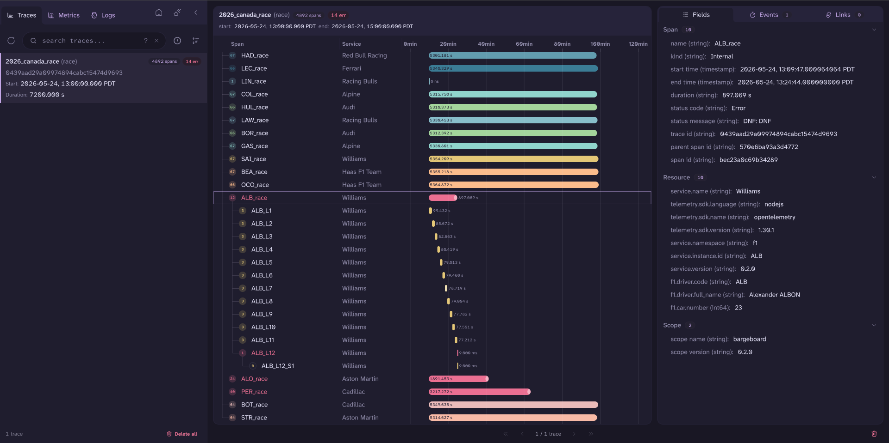
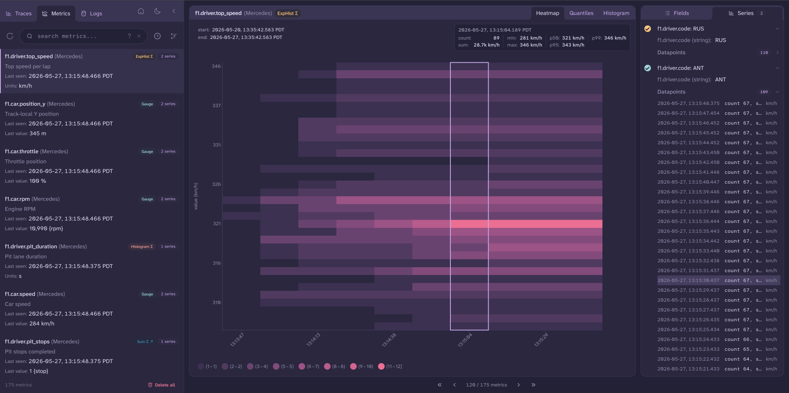
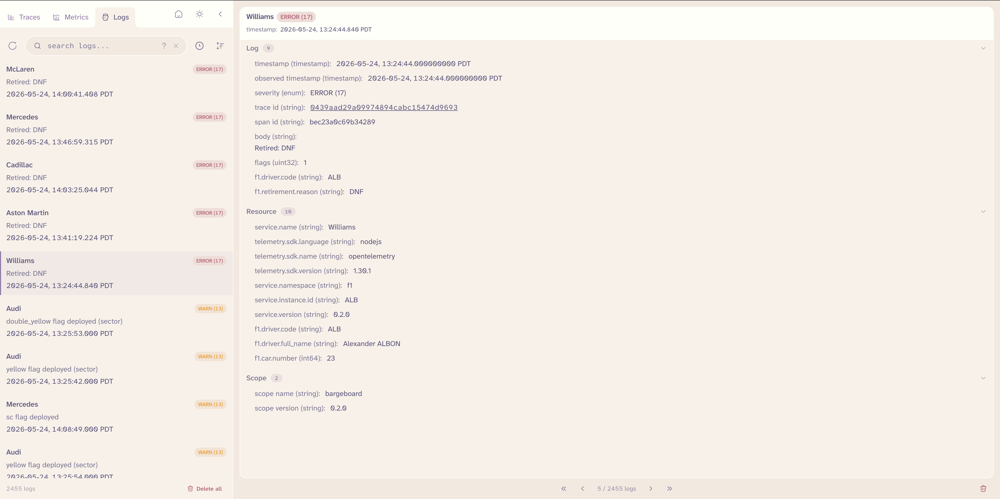
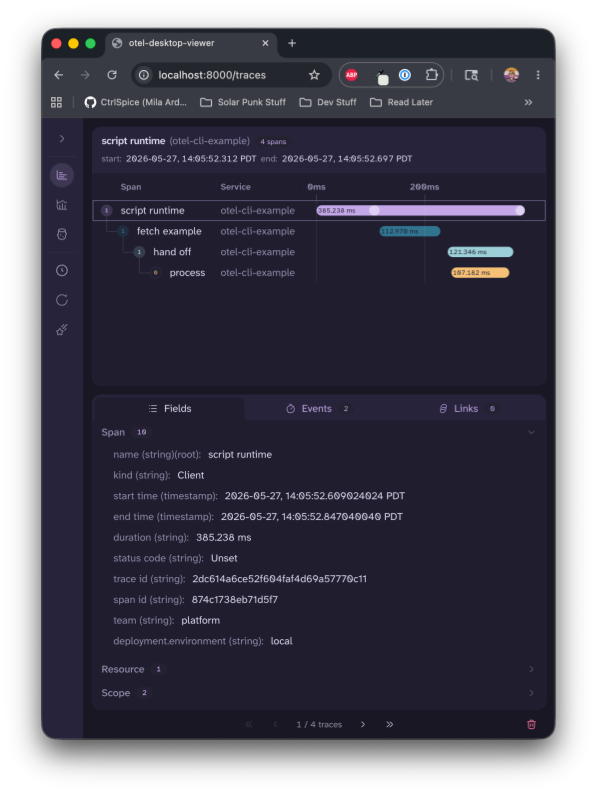

# otel-desktop-viewer

<p align="center">
  Hello there.
  
</p>

`otel-desktop-viewer` is a CLI tool for exploring your OpenTelemetry traces, metrics, and logs locally. Built in Go on top of the [OpenTelemetry Collector](https://github.com/open-telemetry/opentelemetry-collector), with a DuckDB backend and a Svelte web UI.

~~Also, it has a dark mode~~  
Y'all.  
I added another dark mode.  
It has **two** dark modes now.

## Table of Contents

- [Screenshots](#screenshots)
- [Getting Started](#getting-started)
  - [Via Homebrew Cask](#via-homebrew-cask)
  - [Via GitHub Releases](#via-github-releases)
  - [Via apt / dnf (Linux)](#via-apt--dnf-linux)
  - [Via `go install`](#via-go-install)
  - [Via Docker](#via-docker)
- [Docker Compose](#docker-compose)
- [Command Line Options](#command-line-options)
- [Configuring Your OpenTelemetry SDK](#configuring-your-opentelemetry-sdk)
- [Example With `otel-cli`](#example-with-otel-cli)
- [Implementation](#implementation)
- [What's With the Axolotl??](#whats-with-the-axolotl)
- [Contributing](#contributing)
- [License](#license)

## Screenshots

### Traces



### Metrics



### Logs



## Getting Started

Pick your preferred install method. Once it's running, the UI is at `localhost:8000` with OTLP receivers on `localhost:4317` (gRPC) and `localhost:4318` (HTTP).

#### Via Homebrew Cask

Easiest install on macOS.

```bash
brew tap ctrlspice/otel-desktop-viewer
brew install --cask otel-desktop-viewer
```

#### Via GitHub Releases

Download a pre-built binary for your platform from [Releases](https://github.com/CtrlSpice/otel-desktop-viewer/releases).

| Platform | Architecture          | File                                      |
| -------- | --------------------- | ----------------------------------------- |
| macOS    | Apple Silicon (M1–M4) | `otel-desktop-viewer_darwin_arm64.tar.gz` |
| macOS    | Intel                 | `otel-desktop-viewer_darwin_amd64.tar.gz` |
| Linux    | x86_64                | `otel-desktop-viewer_linux_amd64.tar.gz`  |
| Linux    | arm64                 | `otel-desktop-viewer_linux_arm64.tar.gz`  |
| Windows  | x86_64                | `otel-desktop-viewer_windows_amd64.zip`   |

On Windows, unzip the archive and run `otel-desktop-viewer.exe`.

> **Linux:** release binaries require **glibc 2.39 or newer** (Ubuntu 24.04+, Debian 13+, Fedora 40+). This applies to the tarballs, the `.deb`/`.rpm` packages, and the Docker images.

```bash
# example: macOS Apple Silicon
curl -LO https://github.com/CtrlSpice/otel-desktop-viewer/releases/latest/download/otel-desktop-viewer_darwin_arm64.tar.gz
tar xzf otel-desktop-viewer_darwin_arm64.tar.gz
./otel-desktop-viewer
```

#### Via apt / dnf (Linux)

`.deb` and `.rpm` packages for Linux, published to [GemFury](https://gemfury.com/) with each stable release.

**Debian / Ubuntu:**

```bash
curl -fsSL https://apt.fury.io/ctrlspice/gpg.key | sudo gpg --dearmor -o /usr/share/keyrings/fury.gpg
echo "deb [signed-by=/usr/share/keyrings/fury.gpg] https://apt.fury.io/ctrlspice/ * *" \
  | sudo tee /etc/apt/sources.list.d/fury.list
sudo apt update
sudo apt install otel-desktop-viewer
```

**Fedora / RHEL:**

```bash
sudo tee /etc/yum.repos.d/fury.repo <<EOF
[fury]
name=Gemfury Repo
baseurl=https://yum.fury.io/ctrlspice/
enabled=1
gpgcheck=0
EOF
sudo dnf install otel-desktop-viewer
```

#### Via `go install`

Building from source? You'll need Go with CGO enabled.

```bash
go version
go env CGO_ENABLED   # should print 1
gcc --version        # or cc --version
```

**On Windows**: You'll need MSYS2 for CGO compilation:

1. **Install MSYS2**: Download and install from https://www.msys2.org/
2. **Open MSYS2 UCRT64 terminal**:
   - After installing MSYS2, you'll see multiple terminal options in the Start Menu
   - Choose **"MSYS2 UCRT64"** (not "MSYS2 MinGW 64-bit" or "MSYS2 MSYS")
   - Or run: `C:\msys64\ucrt64.exe`
3. **Install required packages**:
   ```bash
   pacman -S mingw-w64-ucrt-x86_64-gcc mingw-w64-ucrt-x86_64-toolchain
   ```
4. **Add MSYS2 to your PATH** (choose one):

   **Command Prompt (permanent)**:

   ```cmd
   setx PATH "%PATH%;C:\msys64\ucrt64\bin"
   ```

   **PowerShell (permanent)**:

   ```powershell
   [Environment]::SetEnvironmentVariable("PATH", [Environment]::GetEnvironmentVariable("PATH", "User") + ";C:\msys64\ucrt64\bin", "User")
   ```

   **PowerShell (current session only)**:

   ```powershell
   $env:PATH += ";C:\msys64\ucrt64\bin"
   ```

5. **Restart your terminal** for PATH changes to take effect
6. **Test the setup**:
   ```cmd
   gcc --version
   g++ --version
   ```

**On Linux/macOS**: Usually fine if the checks above pass.

`@latest` resolves to the newest **stable** tag on the Go module proxy — not alpha/beta releases. Pin a version explicitly (e.g. `@v0.3.0`) or use a [GitHub Release](#via-github-releases) binary to avoid compiling locally.

```bash
# install the CLI tool
go install github.com/CtrlSpice/otel-desktop-viewer@latest

# run it!
$(go env GOPATH)/bin/otel-desktop-viewer

# if you have $GOPATH/bin added to your $PATH you can call it directly!
otel-desktop-viewer

# if not you can add it to your $PATH by running this or adding it to
# your startup script (usually ~/.bashrc or ~/.zshrc)
export PATH="$(go env GOPATH)/bin:$PATH"
```

#### Via Docker

You can run otel-desktop-viewer using Docker without installing Go or building locally.

Pull from GitHub Container Registry (auto-selects your architecture):

```bash
docker pull ghcr.io/ctrlspice/otel-desktop-viewer:latest
docker run -p 8000:8000 -p 4317:4317 -p 4318:4318 ghcr.io/ctrlspice/otel-desktop-viewer:latest
```

Or pin a specific version:

```bash
docker pull ghcr.io/ctrlspice/otel-desktop-viewer:v0.3.0
```

Explicit per-arch tags are also available:

```bash
docker pull ghcr.io/ctrlspice/otel-desktop-viewer:latest-amd64
docker pull ghcr.io/ctrlspice/otel-desktop-viewer:latest-arm64
```

Or build locally from source:

```bash
docker build --tag otel-desktop-viewer:latest .
docker run -p 8000:8000 -p 4317:4317 -p 4318:4318 otel-desktop-viewer:latest
```

## Docker Compose

Running your app in Compose? Add the viewer as a service and export OTLP to `otel-desktop-viewer:4318` (HTTP) or `otel-desktop-viewer:4317` (gRPC).

```yaml
services:
  app:
    image: your-apps-image-tag
    # Add your app configuration here

  otel-desktop-viewer:
    image: ghcr.io/ctrlspice/otel-desktop-viewer:latest
    ports:
      - "8000:8000"
      - "4317:4317"
      - "4318:4318"
```

## Command Line Options

Telemetry is stored in memory by default. Use `--db` to persist to a file.

```bash
Flags:
      --browser-port int   Port for the web UI and JSON-RPC API (default 8000)
      --db string          DuckDB file path (default: in-memory)
      --grpc int           OTLP gRPC listen port (default 4317)
      --host string        Host for OTLP receivers and the web UI (default localhost)
      --http int           OTLP HTTP listen port (default 4318)
      --metrics-port int   Port for the collector's internal Prometheus self-telemetry (default 8888)
      --open-browser       Open the browser on launch (default true)
  -h, --help               help for otel-desktop-viewer
  -v, --version            version for otel-desktop-viewer
```

```bash
otel-desktop-viewer --db ./telemetry.duckdb
```

## Configuring Your OpenTelemetry SDK

Point your app's OTLP exporter at the viewer. Send to `http://localhost:4318` (HTTP) or `http://localhost:4317` (gRPC).

If your SDK supports [configuration via environment variables](https://opentelemetry.io/docs/concepts/sdk-configuration/otlp-exporter-configuration/), you can use:

```bash
# HTTP
export OTEL_EXPORTER_OTLP_ENDPOINT="http://localhost:4318"
export OTEL_TRACES_EXPORTER="otlp"
export OTEL_METRICS_EXPORTER="otlp"
export OTEL_LOGS_EXPORTER="otlp"
export OTEL_EXPORTER_OTLP_PROTOCOL="http/protobuf"

# gRPC
export OTEL_EXPORTER_OTLP_ENDPOINT="http://localhost:4317"
export OTEL_TRACES_EXPORTER="otlp"
export OTEL_METRICS_EXPORTER="otlp"
export OTEL_LOGS_EXPORTER="otlp"
export OTEL_EXPORTER_OTLP_PROTOCOL="grpc"
```

## Example With `otel-cli`

If you have [`otel-cli`](https://github.com/equinix-labs/otel-cli) installed, it is a great way to send rich test traces from shell scripts. otel-cli supports span kinds, attributes, events, trace propagation, and background spans—much more than a single `exec` wrapper.

Start the desktop viewer in one terminal:

```bash
otel-desktop-viewer
```

In another terminal, point otel-cli at the viewer:

```bash
export OTEL_EXPORTER_OTLP_ENDPOINT=http://localhost:4318
export OTEL_EXPORTER_OTLP_PROTOCOL=http/protobuf
```

**Quick span** — wrap any command:

```bash
otel-cli exec --service my-service --name "check the archive" curl -s -o /dev/null https://archive.org/
```

**Chained spans** — otel-cli propagates context automatically:

```bash
otel-cli exec --kind producer --service demo --name produce -- \
  otel-cli exec --kind consumer --service demo --name consume sleep 0.2
```

**Rich trace** — background span, events, attributes, and linked child spans:

```bash
sockdir=$(mktemp -d)
carrier=$(mktemp)

otel-cli span background \
  --service "otel-cli-example" \
  --name "script runtime" \
  --attrs "deployment.environment=local,team=platform" \
  --tp-carrier "$carrier" \
  --sockdir "$sockdir" &
sleep 0.1

otel-cli span event --name "starting work" --attrs "phase=setup,attempt=1" --sockdir "$sockdir"

otel-cli exec --service "otel-cli-example" --name "fetch example" --kind client \
  --attrs "http.url=https://example.com" \
  --tp-carrier "$carrier" \
  curl -s -o /dev/null https://example.com

otel-cli exec --kind producer --service "otel-cli-example" --name "hand off" \
  --tp-carrier "$carrier" -- \
  otel-cli exec --kind consumer --service "otel-cli-example" --name "process" sleep 0.1

otel-cli span event --name "finished" --attrs "phase=teardown,status=ok" --sockdir "$sockdir"
otel-cli span end --sockdir "$sockdir"
```

Open `http://localhost:8000/traces` to explore the result. For more otel-cli features (custom span times, `{{traceparent}}` in command args, config files, and a built-in TUI server), see the [otel-cli README](https://github.com/equinix-labs/otel-cli).



## Implementation

The CLI is a custom OpenTelemetry Collector distribution. A `desktop` exporter:

- ingests traces, metrics, and logs into **DuckDB** (in-memory by default, optional on-disk persistence via `--db`)
- exposes data through a **JSON-RPC** API at `POST /rpc`
- serves a **Svelte** web UI embedded in the binary via [`go:embed`](https://go.dev/embed/)

See [ARCHITECTURE.md](ARCHITECTURE.md) for a full system overview.

## What's With the Axolotl??

Her name is **Lulu Axol'Otel**. She is very pink, and I love her.

More seriously, I like to give my [side projects](https://github.com/CtrlSpice/bumblebee-consolematch) an [animal theme](https://github.com/CtrlSpice/yak-vs-yak) to add a little aesthetic interest on what otherwise might be fairly plain applications.

## Contributing

See [CONTRIBUTING.md](CONTRIBUTING.md). Please read our [Code of Conduct](CODE_OF_CONDUCT.md) before participating.

## License

Apache 2.0, see LICENSE
