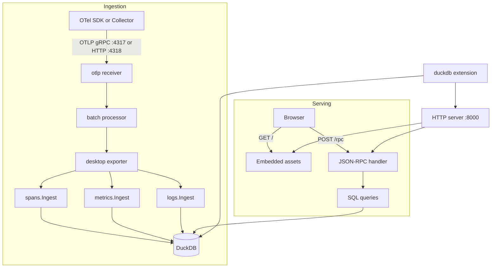

# otel-desktop-viewer architecture

otel-desktop-viewer is a custom OpenTelemetry Collector distribution. A
`desktop` exporter writes traces, metrics, and logs to DuckDB. A `duckdb`
extension owns the database, HTTP server, retention loop, and embedded Svelte
UI.

## System overview



| Port | Purpose |
| --- | --- |
| 4317 | OTLP gRPC |
| 4318 | OTLP HTTP |
| 8000 | Web UI and JSON-RPC |
| 3001 | Vite development server |

## Components

The binary uses these Collector components:

| Kind | Component |
| --- | --- |
| Receiver | `otlp` |
| Processor | `batch` |
| Exporter | `desktop` |
| Extension | `duckdb` |

The default pipelines are:

```text
traces:  otlp -> batch -> desktop
metrics: otlp -> batch -> desktop
logs:    otlp -> batch -> desktop
```

The batch processor sends at 8,192 items or after 1 second. The exporter uses a
blocking sending queue with one consumer. Each write has a 30-second ingest
deadline.

The `duckdb` extension starts before pipeline components and stops after them.
It opens the store, starts the HTTP server and retention loop, then exposes the
store through the Collector extension map. Each exporter resolves that shared
store during `Start`.

Shutdown stops retention, stops HTTP serving, and closes the store. Store close
uses the shutdown context rather than waiting indefinitely for readers.

## Repository layout

```text
otel-desktop-viewer/
|-- main.go
|-- components.go
|-- desktopexporter/
|   |-- exporter.go
|   |-- duckdbextension/
|   `-- internal/
|       |-- server/
|       |-- store/
|       `-- frontend/
|-- scripts/
|-- Makefile
`-- docs/
```

The frontend build is committed under
`desktopexporter/internal/server/static/` and embedded with `go:embed`.

## Store ownership

`store.Store` has two DuckDB handles:

| Handle | Access | Purpose |
| --- | --- | --- |
| `driver.Conn` | `WithConn` | Ingest appenders |
| `*sql.DB` | `WithDBRead`, `WithDBWrite` | Queries, deletion, retention, checkpointing |

`WithConn` serializes ingest calls and takes the store read lock. Queries may run
at the same time as ingest. `WithDBWrite` excludes ingest and queries while a
pool mutation runs.

DuckDB appenders buffer rows until a flush or close. A query can therefore lag
ingest by one batch. Dictionary rows may become visible before their owner rows,
but read queries join from owners to dictionary entries and do not expose
unowned values.

Callers never receive the raw `*sql.DB`. Production code runs database work
inside a store closure so lock ownership covers the full operation.

## Schema

Schema objects live in `desktopexporter/internal/store/queries/ddl/`. Each
directory has an `_order` manifest because tables, indexes, and macros have
creation dependencies. Store startup verifies that every embedded DDL file is
listed exactly once.

The current schema version is 22. Store startup validates `schema_meta` before
running DDL. A mismatched, malformed, or unversioned telemetry database is
rejected without modification. The store does not migrate or reset databases.

### Tables

| Table | Stored data |
| --- | --- |
| `attributes` | Distinct typed attribute values |
| `resources` | Received Resource payloads |
| `scopes` | Received InstrumentationScope payloads |
| `spans` | Span records |
| `events` | Span events |
| `links` | Span links |
| `logs` | Log records |
| `metrics` | One exact OTel Metric identity |
| `metric_series` | One series for a Metric and datapoint attribute set |
| `metric_datapoints` | Gauge, Sum, Histogram, and ExponentialHistogram datapoints |
| `histogram_bounds` | Deduplicated explicit histogram bounds |
| `exemplars` | Metric exemplars |
| `ingest_rejections` | Refused record diagnostics |

`metrics.id` and `metric_series.id` are viewer-generated UUIDs. Public APIs call
them `metricRef` and `seriesRef`. `getMetricSeries` exposes `metric_datapoints.id`
as `datapointRef`; `getLog` exposes `logs.id` as `logRef`. These references are
scoped to one database. Received OTel trace/span identifiers remain `traceID`
and `spanID`.

Metric identity includes the complete Resource payload key, complete Scope,
Scope schema URL, name, unit, type, temporality where applicable, and
monotonicity where applicable. Description and metadata remain received Metric
fields but do not identify a Metric. `service_name` is a derived search and
display field from Resource attributes.

`metric_series` identifies one Metric plus one datapoint attribute set.
`metric_datapoints` keeps both `metric_id` and `series_id`, along with the exact
attribute IDs needed to render the datapoint.

### Values and precision

Attributes, log bodies, and Metric metadata use recursive tagged JSON. Every
value is `{kind,value}`.

- int64 values use decimal strings.
- finite doubles use JSON numbers.
- negative zero and non-finite doubles use exact IEEE-754 bit text.
- arrays preserve order.
- maps keep the last received value per key, then sort the surviving entry list.
- empty values use `null` inside the tagged value.

Received OTLP timestamps use DuckDB `UBIGINT`. Span kind, span status code, and
Metric aggregation temporality use signed `INTEGER`, including unknown values.
The API returns numeric codes with derived display labels.

Histogram and ExponentialHistogram `sum`, `min`, and `max` are nullable. NULL
means absent; zero means present zero. Histogram counts and bucket vectors use
unsigned 64-bit storage.

Optional parent, correlation, exemplar, and link target IDs remain NULL when
absent. The store does not invent zero IDs.

### Attributes

The attribute dictionary is keyed by a 128-bit prefix of SHA-256 over the key
and canonical tagged value. Owners store sorted UUID arrays. Identical typed
values deduplicate across owner categories. Each owner's attribute collection
keeps the last received occurrence of each key before encoding and hashing.
Selection is local to that collection: it never combines Resource, Scope, record,
event, link, datapoint, exemplar or metadata attributes. Earlier conflicting values
are not stored. The incoming pdata is not mutated.

DuckDB cannot enforce foreign keys into UUID arrays. Ingest writes dictionary
rows before owner rows. Store tests check for dangling references.

`ingest.SweepOrphans` removes dictionary entries with no owners. Clear operations
sweep immediately. Retention sweeps before measuring and after each prune round.
Single-entity deletes leave cleanup to the next clear or retention sweep.

Cross-signal correlation fields are not foreign keys. Logs and exemplars can
arrive before a span, after it, or without it. Link target IDs may point outside
the stored trace set.

## Ingest

Ingest reads OpenTelemetry pdata directly. It does not build intermediate Go
domain objects.

Each request uses two passes:

1. Encode and hash attributes, then resolve Resource, Scope, Metric, and series
   identities.
2. Append spans, logs, Metric datapoints, exemplars, events, and links.

The dictionary and identity tables use inserts with conflict handling. High
volume owner tables use DuckDB appenders.

## Query layer

Read queries are `.sql` files under `queries/spans`, `queries/logs`, and
`queries/metrics`. `go:embed` loads them at startup. `text/template` inserts only
named SQL fragments; values use bound parameters.

The query registry checks that every file has one Go name and every Go name has
one file. Golden tests cover rendered SQL.

Queries produce JSON with DuckDB functions and return `json.RawMessage`. The Go
server forwards those bytes without response structs or re-encoding.

Shared JSON shapes and numeric encoders live in SQL macros. Ordered arrays use
`to_json(list(value order by key))` so response order is explicit.

## Search

The frontend sends a query tree. Signal-specific mappers convert supported
fields and operators to parameterized SQL.

Built-in fields keep their native types. Received attribute keys keep exact
case and spelling. Explicit attribute references include owner scope, key, and
stored kind, for example:

```text
attr(span, "attempts", int64) > 2
```

Attribute equality can calculate the dictionary ID before querying and use
`list_contains(attribute_ids, ?::uuid)`. Other operators join the dictionary and
compare the stored value.

## Metric views

`get_metric_view.sql` computes chart data:

- M4 reduction for Gauge and Sum series;
- Delta and Cumulative histogram merges;
- requested quantiles;
- Sum, Average, and Rate views;
- sparklines;
- `Selected` and `All` cross-series aggregates.

Exact received integers and counts remain decimal text on the wire and become
frontend `bigint` values. Derived chart values use JavaScript numbers. See
[metric-resolution.md](metric-resolution.md) for the full contract.

## HTTP and JSON-RPC

The server exposes two routes:

| Route | Purpose |
| --- | --- |
| `POST /rpc` | JSON-RPC 2.0, with a 1 MB request limit |
| `GET /*` | Embedded frontend and client-route fallback |

The server binds to `localhost` by default. CORS accepts HTTP and HTTPS origins
so the Vite development server can call `/rpc`.

### Methods

| Method | Result |
| --- | --- |
| `query` | Read-only SQL rows |
| `searchTraceSummaries` | Trace list summaries |
| `getTraceOverview` | Compact spans and trace-linked log summaries |
| `getTraceView` | Full trace display data |
| `getSpan` | One exact span with associated logs |
| `getTraceSpanCount` | Span count for one trace |
| `searchLogSummaries` | Log list summaries |
| `getTraceLogSummaries` | Log summaries carrying one trace ID |
| `getLog` | One complete normalized log |
| `searchMetricSummaries` | Metric list summaries |
| `getMetric` | Exact Metric identity and series catalogue |
| `getMetricSeries` | Exact retained datapoints for one series and window |
| `getMetricView` | Chart data for one Metric and window |
| `getMetricAggregateView` | Cross-series aggregate data |
| `getTraceAttributeDefinitions` | Trace attribute definitions |
| `getTraceAttributeDefinitionsByTraceID` | Attribute definitions for one trace |
| `getLogAttributeDefinitions` | Log attribute definitions |
| `getMetricAttributeDefinitions` | Metric attribute definitions |
| `searchAttributeMatches` | Attribute fields matching text |
| `getFieldValueCompletions` | Completion values for one field |
| `getStats` | Signal counts and store size |
| `clearTraces`, `clearLogs`, `clearMetrics` | Delete one signal |
| `deleteSpansByTraceID` | Delete traces by received trace ID |
| `deleteLogsByRefs` | Delete logs by viewer references |
| `deleteMetric` | Delete one Metric by viewer reference |

Named and positional parameters share one validation path. Time bounds use
nullable decimal nanosecond strings. `null` means unbounded.

Requests for missing entities return signal-specific errors. Invalid received
IDs and invalid viewer references return separate parameter errors. Caller
cancellation maps to `-32010` rather than an internal error.

## Service discovery CLI

`services` computes a summary through the existing read-only `query` RPC, with
no stored service entity. It groups the stored `service_name` text projection
and Resource `service.namespace` converted with `pcommon.Value.AsString` rules.
Missing/empty namespaces share a label. Different types with equal text labels
share a summary; surviving source attribute types remain available for inspection.

Each field is computed within the selected inclusive time window:

| Field | Source and formula | Unit / precision |
| --- | --- | --- |
| `spanCount` | Number of stored spans, by composite trace/span identity | Exact integer records |
| `errorSpanCount` | Spans with received status code 2 | Exact integer records |
| `logCount` | Number of stored logs, independent of correlation IDs | Exact integer records |
| `errorLogCount` | Logs with received severity number 17–24 | Exact integer records |
| `metricCount` | Distinct `metrics.id` with qualifying datapoints | Exact integer Metric identities, not names or series |
| `dataPointCount` | Number of stored datapoints; histogram buckets/count do not multiply it | Exact integer records |
| `lastSeen` | Maximum span start, effective log time, or datapoint timestamp | Exact unsigned Unix nanoseconds, decimal string |

Effective log time is received timestamp, falling back to observed timestamp
when timestamp is zero. The same times determine window eligibility. `lastSeen`
is not ingestion time or proof of liveness. Signals aggregate independently before
joining Resource identity, avoiding multiplied counts. Instances/versions contribute
to the same namespace/name summary. JSON includes resolved window bounds and
look-ahead truncation. The exact-name `--service` filter spans all namespaces.

## Frontend

The Svelte 5 frontend uses TypeScript, Vite, Tailwind CSS, DaisyUI, bits-ui,
CodeMirror, and layerchart.

Routes are:

| Route | Page |
| --- | --- |
| `/` | Home and connection help |
| `/traces`, `/traces/{traceID}` | Trace list and detail |
| `/logs`, `/logs/{logRef}` | Log list and detail |
| `/metrics`, `/metrics/{metricRef}` | Metric list and detail |

Page-local state and Svelte context modules own routing, time selection, list
state, and Metric presentation state. URL updates use explicit push or replace
history modes.

`telemetry-service.ts` is the wire boundary. It sends JSON-RPC requests,
validates runtime payloads, converts exact integer text to `bigint`, decodes
tagged values, and maps wire types to domain types.

Metric aggregation remains in SQL. The frontend chooses tabs, colours, visible
series, chart coordinates, and selected datapoints. Legend changes request only
the aggregate envelope.

The UI polls `getStats` every 3 seconds on signal pages and every 5 seconds on
the home page. There is no push channel.

## Trace view wire format

`getTraceView` sends Resources and Scopes once in top-level maps. Spans refer to
them by sequence key. Sequence values are stable within one database and are not
reused after deletion.

The response stores one absolute `traceStart`. Each span carries a start offset
and duration. `traceStart` is the minimum span start in the response, which
handles traces without roots and clock skew between hosts.

The frontend replaces a trace as one unit per fetch. It does not merge offsets
from responses with different baselines.

## Development

```text
Terminal 1: make dev-go
Terminal 2: make dev-ts
Browser:    http://localhost:3001
```

Use `make build && ./otel-desktop-viewer` for an embedded production build.

## Related files

- Collector wiring: `main.go`, `components.go`, `desktopexporter/exporter.go`
- Store owner: `desktopexporter/duckdbextension/`
- Server: `desktopexporter/internal/server/`
- Storage: `desktopexporter/internal/store/`
- Frontend: `desktopexporter/internal/frontend/`
- Build and release: `Makefile`, `Dockerfile`, `.goreleaser.yaml`
