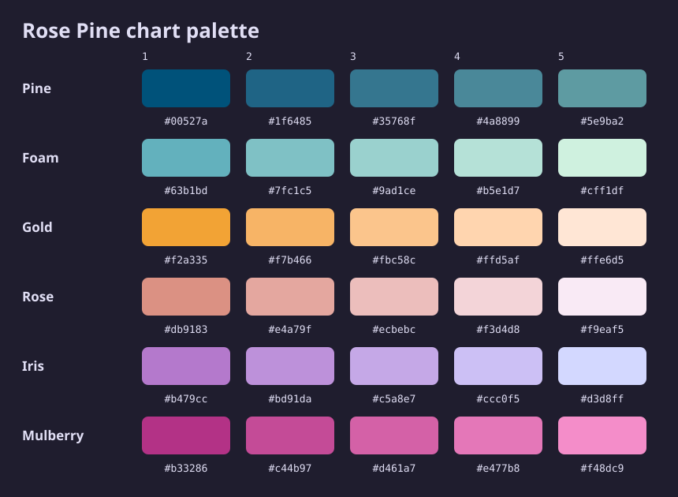
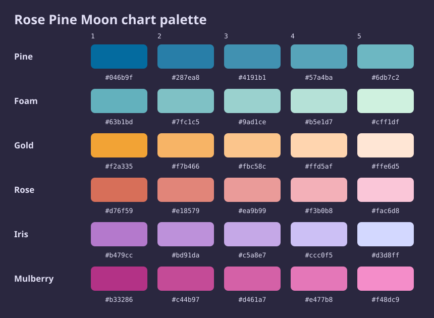
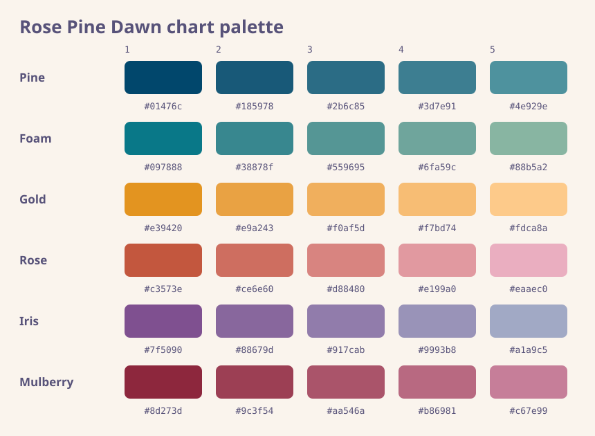

# Chart Palettes

The chart palette has six families with five approved swatches each. Charts interleave families and levels so neighbouring series begin far apart in both hue and lightness.

How the ramps were constructed

The literal swatch table is the shipped source of truth. The construction work used OKLab, where distance between two colours is the Euclidean distance `sqrt((dL)^2 + (da)^2 + (db)^2)`. Ramps sample evenly along a fitted OKLab line; before interpolation, out-of-gamut endpoints have chroma reduced while preserving lightness and hue direction. Rounded measured output is not full-precision source data, and this recipe describes deliberate adjustments rather than a formula that regenerates every retained hex.

| Adjustment | Applied recipe |
| --- | --- |
| Initial ramps | Four positions from `Deep + i * step * unit(anchor - Deep)`, with `i = 0..3`; the proportional anchor step is `0.033` for Rose Pine and Moon, `0.034` for Dawn. |
| Wider endpoints | Extend both measured ramp ends by `0.040` OKLab along the row direction before endpoint-first gamut fitting. Foam's deep end additionally shifts `[0, -0.024, +0.046]` toward sea-green. |
| Gold | Rose Pine and Moon use deep `[0.775000, 0.051303, 0.140954]` and light `[0.899603, 0.030191, 0.061682]`, with a warmer approximately 70 degree OKLCH direction. Dawn uses deep `[0.730000, 0.051303, 0.140954]`; its final light target is `[0.870000, 0.030000, 0.095000]`. |
| Five positions | A fifth equal light-side sample was added after fitted endpoints. Dawn Gold was redistributed across all five points to retain even spacing under its final light cap. |
| Mulberry | Rose Pine and Moon use a dark-end OKLCH hue target of 345 degrees before gamut fitting. |

