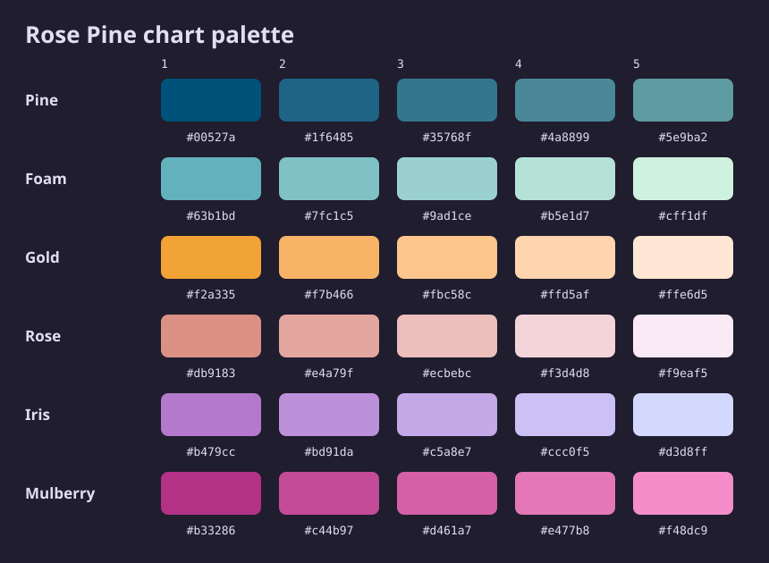
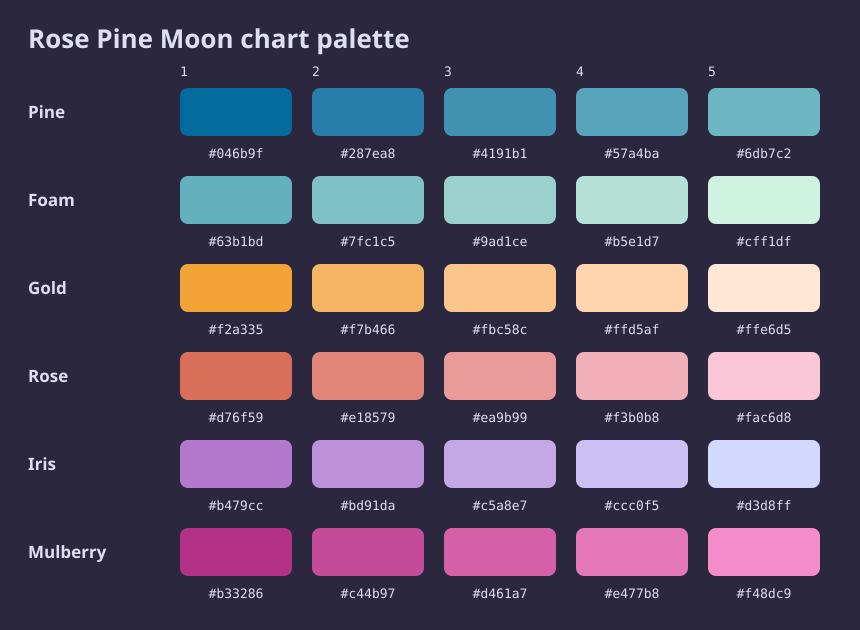
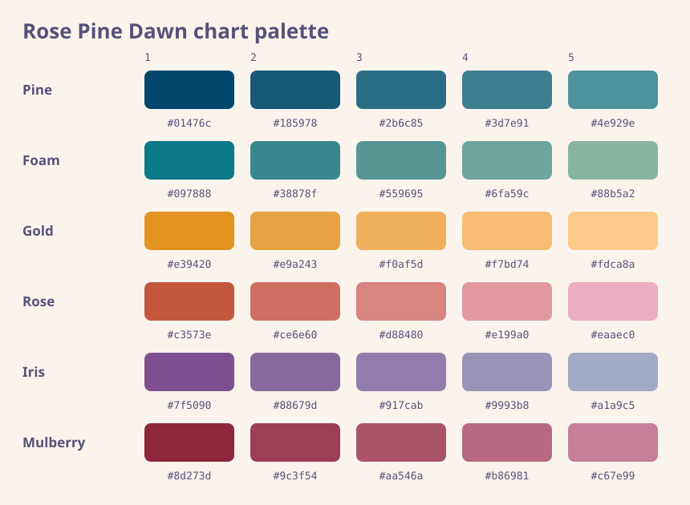

# Chart Palettes

The chart palette has six families with five approved swatches each. Charts interleave families and levels so neighbouring series begin far apart in both hue and lightness.

How the ramps were constructed

The shipped swatch table is authoritative. The palette uses OKLab distance: `sqrt((dL)^2 + (da)^2 + (db)^2)`. Each ramp samples a fitted OKLab line. Out-of-gamut endpoints lose chroma while keeping their lightness and hue direction. The recipe does not reproduce every retained hex exactly.

| Adjustment | Applied recipe |
| --- | --- |
| Initial ramps | Four positions from `Deep + i * step * unit(anchor - Deep)`, with `i = 0..3`; the proportional anchor step is `0.033` for Rose Pine and Moon, `0.034` for Dawn. |
| Wider endpoints | Extend both measured ramp ends by `0.040` OKLab along the row direction before endpoint-first gamut fitting. Foam's deep end additionally shifts `[0, -0.024, +0.046]` toward sea-green. |
| Gold | Rose Pine and Moon use deep `[0.775000, 0.051303, 0.140954]` and light `[0.899603, 0.030191, 0.061682]`, with a warmer approximately 70 degree OKLCH direction. Dawn uses deep `[0.730000, 0.051303, 0.140954]`; its final light target is `[0.870000, 0.030000, 0.095000]`. |
| Five positions | A fifth equal light-side sample was added after fitted endpoints. Dawn Gold was redistributed across all five points to retain even spacing under its final light cap. |
| Mulberry | Rose Pine and Moon use a dark-end OKLCH hue target of 345 degrees before gamut fitting. |

